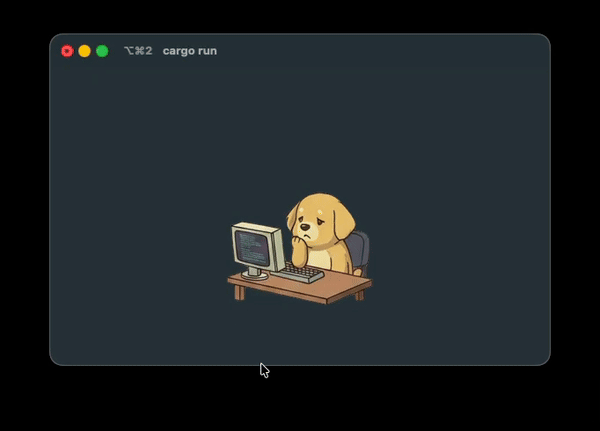
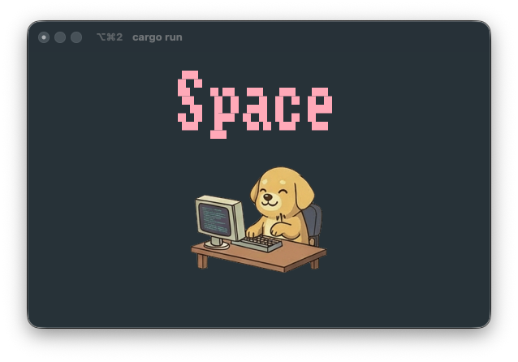

# TapWatch

A terminal-based typing companion that displays an animated dog reacting to your keystrokes!

[](https://crates.io/crates/tapwatch)
[](https://opensource.org/licenses/MIT)

<p align="center">
  
</p>

## Features

- Animated Dog Companion - Watch a cute dog react to your typing
- Global Key Capture - Monitors keystrokes system-wide
- Sprite Animation - Smooth animations with idle and typing states
- Big Key Display - See your last pressed key in stylish large text
- Typing Effects - New characters appear with a coalesce animation
- Text Fade Out - Text dissolves when you stop typing
- Window Positioning - Snap window to screen edges with arrow keys
- Compact Layout - Perfect as a coding companion

## Installation

```bash
cargo install tapwatch
```

Or build from source:

```bash
git clone https://github.com/wooyukit/tapwatch
cd tapwatch
cargo build --release
```

## Usage

```bash
tapwatch
```

Or run with cargo:

```bash
cargo run --release
```

## Controls

| Key | Action |
|-----|--------|
| `q` | Quit |
| `Esc` | Quit |
| `Ctrl+C` | Quit |
| `Arrow Up` | Fit & move window to top edge |
| `Arrow Down` | Fit & move window to bottom edge |
| `Arrow Left` | Fit & move window to left edge |
| `Arrow Right` | Fit & move window to right edge |

## Terminal Support

TapWatch uses iTerm2's inline image protocol (OSC 1337) for sprite display. For the best experience, use:

- iTerm2 (recommended)
- WezTerm
- Kitty
- Other terminals supporting inline images

## Requirements

- **macOS**: Grant Accessibility permissions for global key capture

## How It Works

TapWatch uses a sprite sheet with a 4x4 grid of dog animations:
- **Rows 1-2**: Idle animation (slow, relaxed)
- **Rows 3-4**: Typing animation (active, excited)

When you type, the dog transitions from idle to an energetic typing animation!

<p align="center">
  
</p>

## Dependencies

- `ratatui` - Terminal UI framework
- `crossterm` - Terminal manipulation
- `rdev` - Global keyboard capture
- `image` - Sprite processing
- `tui-big-text` - Large text rendering
- `tachyonfx` - Text animation effects

## License

MIT License - feel free to use and modify!

## Contributing

Contributions welcome! Feel free to open issues or submit PRs.

---

Made with Rust
